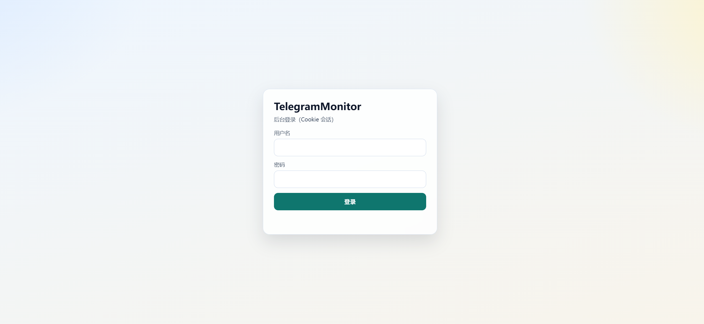
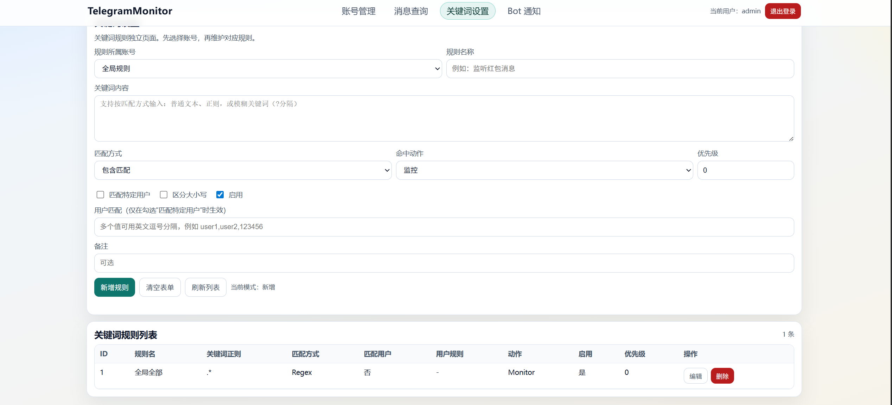
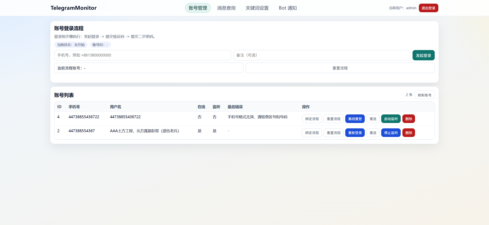
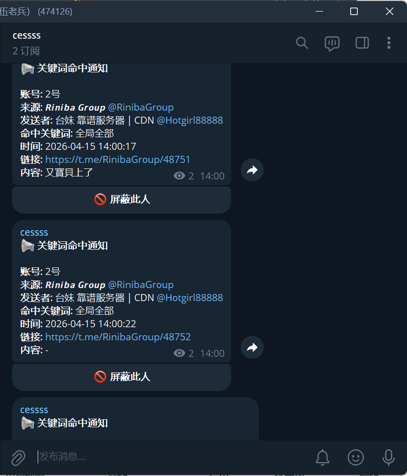

# TelegramMonitor

TelegramMonitor 是一个基于 Web 后台的 Telegram 监听工具，支持账号登录、关键词规则、消息归档和 Bot 通知。

它适合这些场景：

- 监听多个 Telegram 账号的消息
- 根据关键词或发送者做筛选
- 把命中的消息转发到指定 Bot 目标
- 在浏览器里统一管理账号、规则和归档记录

## 功能特性

- Web 后台登录，使用 Cookie 会话认证
- Telegram 账号登录流程，支持验证码和二步验证
- 账号监听启动、停止、重连和自动恢复
- 关键词规则管理
- 支持 `Exact`、`Contains`、`Regex`、`Fuzzy` 四种匹配方式
- 支持按 Telegram 用户 ID 或用户名过滤发送者
- 支持 `Monitor` 和 `Exclude` 两种动作，并带优先级
- 消息归档与分页查询
- 多 Bot 通知发送
- 默认使用 SQLite，也可切换到其他 SqlSugar 支持的数据库

## 页面预览

### 登录页



### 关键词规则



### 监听状态



### 运行效果



## 快速开始

### 1. 准备配置

开发环境可以直接修改 `src/appsettings.json`，或者新建不跟踪的 `src/appsettings.Development.json`。

如果你使用发布包运行，则修改可执行文件旁边的 `appsettings.json`，或者通过环境变量覆盖。

最小可用配置示例：

```json
{
  "Urls": "http://*:5005",
  "Telegram": {
    "DefaultApiId": 123456,
    "DefaultApiHash": "your_api_hash",
    "SessionsPath": "session"
  },
  "Auth": {
    "AdminUsername": "admin",
    "AdminPassword": "change-me"
  },
  "DbConnection": {
    "DbType": "Sqlite",
    "ConnectionString": "DataSource=telegrammonitor.db"
  },
  "Bot": {
    "Enabled": false,
    "Tokens": []
  }
}
```

几个关键点：

- `Telegram.DefaultApiId` 和 `Telegram.DefaultApiHash` 必须先配置，才能发起 Telegram 账号登录。
- `Auth.AdminPassword` 部署前一定要改掉。
- 不要把真实的 `ApiHash`、Bot Token 或生产密码提交到 GitHub。

### 2. 源码运行

```bash
dotnet build src/TelegramMonitor.csproj
dotnet run --project src/TelegramMonitor.csproj
```

默认访问地址：

```text
http://localhost:5005/
```

### 3. 首次使用流程

1. 打开根路径 `/`，用管理员账号登录后台。
2. 进入 `账号管理` 页面 `/dashboard.html`。
3. 输入手机号，发起 Telegram 登录。
4. 根据提示提交验证码和二步密码。
5. 登录成功后开启监听。
6. 进入 `关键词设置` 页面 `/keywords.html` 添加规则。
7. 如需转发通知，再进入 `Bot 通知` 页面 `/bot.html` 配置目标。

## 后台页面说明

- `/`：管理员登录页
- `/dashboard.html`：账号管理和监听控制
- `/keywords.html`：关键词规则管理
- `/messages.html`：消息归档查询
- `/bot.html`：Bot 状态和通知目标管理

## Bot 通知说明

- 通知目标同时支持 `Chat ID` 和 `@username`
- 添加目标时会校验所有已配置 Bot
- 只有所有 Bot 都能访问该会话，并且在群组/频道场景下都具备发消息权限，目标才会添加成功

这意味着：

- 如果是私聊目标，每个 Bot 都必须和这个用户建立过有效会话
- 如果是群组或频道目标，每个 Bot 都必须已经在目标会话中

## Docker 部署

运行示例：

```bash
docker run -d \
  --name telegram-monitor \
  --restart unless-stopped \
  -p 5005:5005 \
  -v ./tm-data:/data \
  -e Telegram__DefaultApiId=123456 \
  -e Telegram__DefaultApiHash=your_api_hash \
  -e Auth__AdminPassword=change-me \
  ghcr.io/riniba/telegrammonitor:latest
```

容器说明：

- 持久化目录统一使用 `/data`
- 程序运行时会把数据库、会话文件和日志链接到 `/data`
- 如果启用了 Bot，多 Bot 产生的 SQLite 文件也会持久化到 `/data`

## `docker-entrypoint.sh` 是做什么的

[`docker-entrypoint.sh`](./docker-entrypoint.sh) 是容器启动脚本，主要作用不是“启动程序本身”，而是“先把容器里的运行数据目录整理好，再启动程序”。

它会在启动时做这些事：

- 创建 `/data` 持久化目录
- 把 `/app/session` 链接到 `/data/session`
- 把 `/app/logs` 链接到 `/data/logs`
- 把 `telegrammonitor.db`
- 把 `wtelegrambot*.db`
- 以及这些数据库对应的 `-wal`、`-shm`、`-journal` 文件

全部迁移或链接到 `/data`

这样做的目的有两个：

- 避免把整个 `/app` 目录都挂载成数据卷
- 保证容器升级或重建后，数据库、Bot 状态、会话文件和日志还能保留下来

简单说：

- `Dockerfile` 负责把程序打进镜像
- `docker-entrypoint.sh` 负责容器启动时整理数据目录并最后执行程序

## 常用环境变量

- `Urls`
- `Telegram__DefaultApiId`
- `Telegram__DefaultApiHash`
- `Telegram__SessionsPath`
- `Auth__AdminUsername`
- `Auth__AdminPassword`
- `DbConnection__DbType`
- `DbConnection__ConnectionString`
- `Bot__Enabled`
- `Bot__Tokens__0`
- `Bot__Tokens__1`

## 发布下载

- 最新发布页：https://github.com/Riniba/TelegramMonitor/releases/latest

## 文档

- GitHub Wiki：https://github.com/Riniba/TelegramMonitor/wiki
- 仓库内已准备新的 Wiki 源文件：[wiki/Home.md](./wiki/Home.md)

## 许可证

本项目使用仓库中的 [LICENSE](./LICENSE)。
